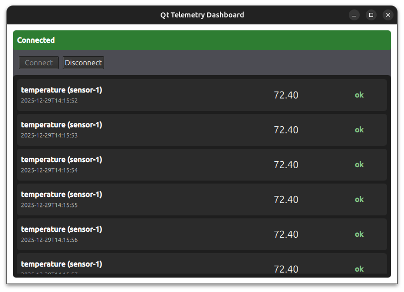

# Qt Telemetry Dashboard

Qt Telemetry Dashboard is a feature-complete Qt 6 application built with a QML frontend and a C++ application/service layer.
The app connects to a public WebSocket echo server, receives live JSON telemetry messages, processes them in C++, and
presents them in a responsive, data-driven UI.

## Screenshot



## Features

- Qt 6.10
- Qt Quick + QML UI
- Live WebSocket connection using QWebSocket
- Real-time telemetry feed parsed and validated in C++
- QAbstractListModel exposing structured data to QML
- Centralized application state via Q_PROPERTY
- Clean separation of concerns:
    - No networking or business logic in QML
    - UI reacts purely to state and models
- Graceful handling of:
    - Connection states
    - Loading states
    - Errors and disconnects
- CMake build system
- Keyboard shortcuts
    - `Esc` to quit
    - `Alt + Enter` to toggle fullscreen

## Project Structure

```bash

qt-telemetry-dashboard/
│
├──src/
│   ├── app/
│   │   ├── AppController.h / .cpp
│   │   └── AppState.h / .cpp
│   │
│   ├── models/
│   │   ├── TelemetryItem.h
│   │   └── TelemetryModel.h / .cpp
│   │
│   ├── services/
│   │   ├── TelemetryService.h / .cpp
│   │   └── ConnectionService.h / .cpp
│   │
│   ├── workers/
│   │   └── TelemetryWorker.h / .cpp
│   │
│   ├── utils/
│   │   └── Logger.h / .cpp
│   │
│   └── main.cpp
│
├── qml/
│   │
│   ├── screens/
│   │   ├── DashboardScreen.qml
│   │   └── ErrorScreen.qml
│   │
│   ├── components/
│   │   ├── TelemetryCard.qml
│   │   └── StatusBar.qml
│   │
│   └── main.qml
│
├── CMakeLists.txt
├── README.md
└── docs/
    └── screenshots/
```

## Key Components

### AppController

- Orchestrates services, models, and state
- Exposed to QML as the single interaction point

### AppState

- Holds global UI state (loading, connected, errorMessage)

### TelemetryService

- Manages WebSocket lifecycle
- Parses incoming JSON messages

### QML

- Declarative UI only
- No networking or parsing logic

##WebSocket Backend

The app connects to a public WebSocket echo/test server.
- JSON telemetry messages are sent and received over the socket
- Messages are parsed and validated in C++
- The backend can easily be swapped for a real telemetry source

Example message format:
```json
{
  "id": "sensor-17",
  "timestamp": 1735234241,
  "type": "temperature",
  "value": 72.4,
  "status": "ok"
}
```

## Getting Started

**Prerequisites**
- Qt 6.x with QtQuick, QtQuick.Controls, and QtQuick.Layouts
- C++17 or newer
- CMake (if building with CMake) or Qt Creator

**Build Instructions**
1. Clone the repository:
```bash
git clone https://github.com/dtb1996/qt-telemetry-dashboard.git
cd qt-telemetry-dashboard
```
2. Open the project in Qt Creator:
    - `File → Open File or Project → select CMakeLists.txt`
3. Build and run the project.

## Purpose of the Project

This project demonstrates:
- Real-world Qt/C++ patterns used in production
- Clean separation between UI and logic
- Strong typing across C++ and QML
- Model-driven UI updates
- Practical WebSocket integration
